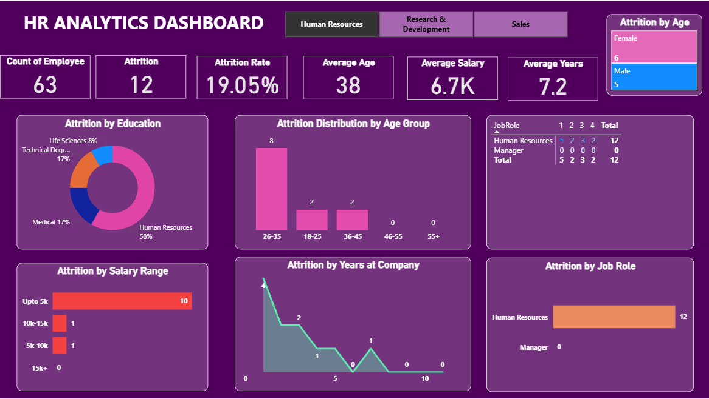

# 📊 HR Analytics Dashboard

> An end-to-end HR Attrition Analysis Dashboard built with Power BI, uncovering workforce trends across departments, salary bands, age groups, and job roles.



---

## 🔍 Overview

Employee attrition is one of the most costly challenges organizations face. This dashboard provides HR teams and executives with **clear, data-driven insights** to understand _who_ is leaving, _why_, and _where_ to focus retention efforts.

---

## 📌 Key Metrics

| Metric                   | Value      |
| ------------------------ | ---------- |
| 👥 Total Employees       | 961        |
| 🚪 Attrition Count       | 133        |
| 📉 Attrition Rate        | **13.84%** |
| 🎂 Average Age           | 37         |
| 💰 Average Salary        | 6.3K       |
| 📅 Avg. Years at Company | 6.9        |

---

## 📈 Dashboard Sections

### 1. 🎓 Attrition by Education

- **Life Sciences** leads at 44%, followed by **Medical (35%)**
- Technical Degree and Other fields account for the remaining ~20%

### 2. 👶 Attrition by Age

- Highest attrition in the **26–35** age group (67 employees)
- Younger workforce (18–25) shows moderate attrition (24)

### 3. 💼 Attrition by Job Role

| Role                      | Attrition |
| ------------------------- | --------- |
| Laboratory Technician     | 62        |
| Research Scientist        | 47        |
| Manufacturing Director    | 10        |
| Healthcare Representative | 9         |

### 4. 💵 Attrition by Salary Slab

- Majority of attrition (110 out of 133) comes from employees earning **up to 5K**
- Clear signal: **low compensation is the #1 attrition driver**

### 5. 📅 Attrition by Years at Company

- Peak attrition at **Year 1** (38 employees) — strong onboarding/retention gap
- Secondary spike around **Year 10** (14 employees)

---

## 🏢 Department Filters

The dashboard supports filtering by:

- 🧑‍💼 Human Resources
- 🔬 Research & Development
- 💹 Sales

---

## 🛠️ Tools Used


---

## 💡 Key Insights & Recommendations

1. **🔴 Compensation is critical** — 83% of attrition comes from the lowest salary band. A structured pay review could significantly reduce churn.
2. **🟡 Early tenure risk** — Year-1 attrition is the highest. Invest in structured onboarding programs and 30/60/90-day check-ins.
3. **🔵 Lab Technicians need attention** — 62 out of 133 total attritions. Consider role-specific engagement surveys.
4. **🟢 Life Sciences graduates** — Highest attrition by education. Partnering with universities for better career pathing may help.

---

## 📁 Repository Structure

```
hr-analytics-dashboard/
│
├── 📊 HR_Analytics_Dashboard.pbix    # Power BI file
├── 📄 HR_Analytics_Data.xlsx         # Raw dataset
├── 🖼️ dashboard_preview.png          # Dashboard screenshot
└── 📝 README.md                      # This file
```

---

## 🚀 How to Use

1. **Clone the repository**

   ```bash
   git clone https://github.com/YOUR_USERNAME/hr-analytics-dashboard.git
   ```

2. **Open in Power BI Desktop**
   - Download [Power BI Desktop](https://powerbi.microsoft.com/desktop/) (free)
   - Open `HR_Analytics_Dashboard.pbix`

3. **Refresh Data** (if using your own dataset)
   - Go to **Home → Transform Data → Refresh**

---

## 📬 Connect With Me

[]([https://www.linkedin.com/in/hasitha-voruganti-a7168a2b8/])
[](https://github.com/Hasitha-Voruganti)

---

_⭐ If you found this useful, please star the repository!_
